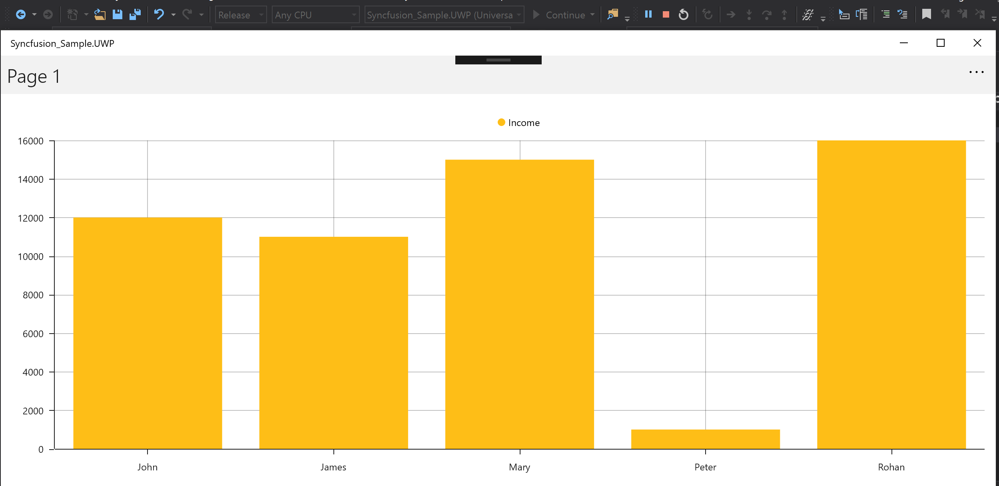

# How to resolve the rendering issue of UWP release mode Syncfusion controls with the latest MVVMCross version

This sample explains about How to render the chart controls in UWP with release mode in MVVMCross 6.1.2 and above.

To render the Syncfusion control in release mode of UWP, need some additional step like to add its renderer as mentioned in below

https://help.syncfusion.com/xamarin/charts/getting-started#universal-windows-platform-uwp

In MVVMCross version 6.12 and above, even we have added those will not render the Syncfusion control. This article mainly to know how to render even with mentioned MVVMCross version with example of SfChart control. 

The below UI with MVVMCross application in debug mode

 

But in release mode, it will be rendered with empty screen even with adding its renderer as below
```
sealed partial class App
    {
        public App()
        {
            this.InitializeComponent();
        }

        protected override void OnLaunched(LaunchActivatedEventArgs activationArgs)
        {
            base.OnLaunched(activationArgs);

            List<Assembly> assembliesToInclude = new List<Assembly>();
            assembliesToInclude.Add(typeof(Syncfusion.SfChart.XForms.UWP.SfChartRenderer).GetTypeInfo().Assembly);
            Xamarin.Forms.Forms.Init(activationArgs, assembliesToInclude);
        }
    }
```
## How to resolve this issue
It has been resolved by changing the MvxFormsWindowsSetup<Core.App, FormsUI.App> with MVVMCrossSetup as shown in below

**Before code changes:**

```
public abstract class UWPApplication : MvxWindowsApplication<MvxFormsWindowsSetup<Core.App, FormsUI.App>, Core.App, FormsUI.App, MainPage>
    {

    }
```

**After code changes:**

```
public abstract class UWPApplication : MvxWindowsApplication<MVVMCrossSetup, Core.App, FormsUI.App, MainPage>
    {

    }

    public class MVVMCrossSetup : MvxFormsWindowsSetup<Core.App, FormsUI.App>
    {
        public override IEnumerable<Assembly> GetViewAssemblies()
        {
            var syncfusionChartRendererAssembly = new List<Assembly>()
                {
                    typeof(Syncfusion.SfChart.XForms.UWP.SfChartRenderer).GetTypeInfo().Assembly
                };
            syncfusionChartRendererAssembly.AddRange(base.GetViewAssemblies());
            return syncfusionChartRendererAssembly;
        }
    }
```


 

